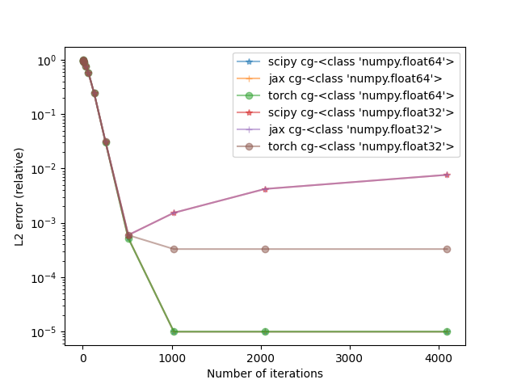

# Solving linear system in Pytorch
This repository implements most commonly used iterative methods for solving linear system Ax=b in Pytorch that can run on GPUs. 

This repository includes Conjugate Gradient (CG) and GMRES. 

The figures below compare my implementation (`torch gmres`, `torch cg` in the figures)
of CG and GMRES against the implementation in Scipy and JAX with single and double precisions. 

A few useful features:
1. Fully implemented in Pytorch and can run on GPUs.
2. Not only support matrix A, but also custom linear operator that can produce Ax. 
3. Stable convergence. 




## How to use

### Demo 1
```python
import torch
from linalg import CG, GMRES

A = torch.tensor([[3.0, 1.0, 0.0], 
                  [1.0, 2.0, -1.0], 
                  [0.0, -1.0, 1.0]])

b = torch.tensor([1.0, 2.0, 3.0])

sol1, info = CG(A, b)
print(f'Solution by CG: {sol1}')

sol2, info = GMRES(A, b)
print(f'Solution by GMRES: {sol2}')

```
Remark: `info` is a tuple where `info[0]` is the number of iterations and `info[1]` is a list of relative residual error at each iteration. 

### Demo 2

```python
import torch
from linalg import CG, GMRES
from functools import partial

A = torch.tensor([[3.0, 1.0, 0.0], 
                  [1.0, 2.0, -1.0], 
                  [0.0, -1.0, 1.0]])

b = torch.tensor([1.0, 2.0, 3.0])

def Avp(A, vec):
    return A @ vec

# create custom linear operator that produces Ax
LinOp = partial(Avp, A)

sol3, info = CG(LinOp, b)
print(f'Solution by CG: {sol3}')

sol4, info = GMRES(LinOp, b)
print(f'Solution by GMRES: {sol4}')

```
See more examples in `test.py`. 